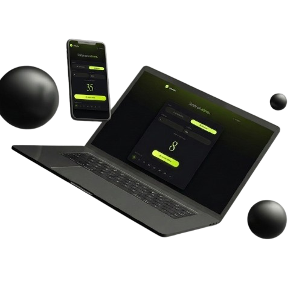

# 🎲 Sorteio II

<div align="center">



</div>

    

Este projeto é um **fork do Sorteio do Mario**, mas segue um caminho próprio: visual mais moderno, slim e profissional, saindo do estilo divertido e colorido do Mario.

## 📋 Visão geral

Sorteio II é uma página interativa para sortear números em dois modos: **automático** e **manual**. O foco desta versão é oferecer um design mais clean e uma experiência melhor para notebooks, tablets e celulares.

## ✨ Funcionalidades

- **Modos de sorteio**:
  - **Automático**: rolagem automática até o número final.
  - **Manual**: inicia o sorteio e permite parar quando quiser.
- **Intervalo customizável**: informe `mínimo` e `máximo` para o sorteio.
- **Histórico de resultados**: os últimos números sorteados são exibidos.
- **Modal do criador**: informações do autor e links para redes sociais.
- **Responsividade**: layout adaptado para diferentes tamanhos de tela.
- **Animações suaves**: efeito visual agradável durante o sorteio.

## 🛠️ Tecnologias

- **HTML5**: estrutura semântica e acessível.
- **CSS3**: layout com Flexbox, variáveis CSS e media queries.
- **JavaScript (ES6+)**: DOM, eventos, controle de estado e sorteio de números.

## 🚀 Como executar

1. Clone o repositório:

    ```bash
    git clone https://github.com/kleber-goncalves/sorteio-curso-ti-2.git
    cd sorteio-curso-ti-2
    ```

2. Abra o arquivo `index.html` no navegador.

> Esta é uma aplicação estática: não é necessário servidor nem dependências.

## 📁 Estrutura do projeto

```text
sorteio-curso-ti-2/
├── index.html          # Página principal
├── style.css           # Estilos principais do site
├── responsivo.css      # Ajustes de responsividade por dispositivo
├── script.js           # Lógica do sorteio e interatividade
├── README.md           # Documentação do projeto
├── img/                # Imagens e ícones
└── font/               # Fontes customizadas
```

## 🎨 Destaques desta versão

- Layout mais consistente em várias larguras de tela.
- Visual modernizado e styling slim.
- Melhor comportamento em notebooks, tablets e celulares.
- Botões e campos mais acessíveis e fáceis de usar.
- Modal e histórico adaptados para dispositivos menores.

## 💡 Próximas melhorias

- Adicionar modo dark/light.
- Salvar histórico no `localStorage`.
- Adicionar sorteio de textos ou itens personalizados.
- Incluir som com opção de ativar/desativar.
- Tornar o site instalável como PWA.

## 🤝 Contribuição

Contribuições são bem-vindas. Se quiser ajudar:

1. Fork o repositório.
2. Crie uma branch: `git checkout -b feature/nome-da-funcionalidade`.
3. Faça commits claros.
4. Envie para o seu fork.
5. Abra um Pull Request.

## 📄 Licença

Este projeto está licenciado sob **MIT License**.

## 👨‍💻 Autor

**Kleber Goncalves**

- GitHub: [@kleber-goncalves](https://github.com/kleber-goncalves)
- LinkedIn: [Kleber Goncalves](https://www.linkedin.com/in/kleber-goncalve-s/)
- Instagram: [@kleber_goncalves.s](https://www.instagram.com/kleber_goncalves.s)
