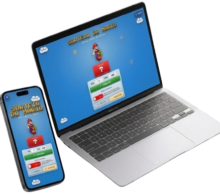

# 🎲 Sorteio do Mario - Roleta Interativa

<div align="center">



</div>

    

Um projeto de estudo criativo: uma roleta de sorteio de números com o tema icônico do Mario Bros! Desenvolvido para demonstrar conceitos de desenvolvimento web front-end, incluindo responsividade, animações CSS e interatividade JavaScript.

## 📋 Sobre o Projeto

Este é um site interativo de sorteio de números, inspirado no universo do Super Mario Bros. O projeto foi criado com o objetivo de estudo e prática de tecnologias web modernas, combinando design atrativo com funcionalidades dinâmicas. Ideal para sorteios em eventos, jogos ou simplesmente para diversão!

### 🎯 Objetivos de Aprendizado

- **Responsividade**: Design adaptável para desktop, tablets e dispositivos móveis.
- **Animações CSS**: Transições suaves e efeitos visuais inspirados em jogos.
- **Interatividade JS**: Lógica de sorteio, modos manual e automático, validação de entrada.
- **Acessibilidade**: Implementação de ARIA labels, navegação por teclado e suporte a leitores de tela.
- **Boas Práticas**: Código limpo, semântico e bem estruturado.

## ✨ Funcionalidades

- **🎮 Modos de Sorteio**:
    - **Manual**: Controle total - clique em "PARAR" para finalizar o sorteio.
    - **Automático**: Sorteio automático com aceleração e desaceleração realista.

- **🔢 Configuração de Intervalo**: Defina o mínimo e máximo para o sorteio (ex: 1 a 100).

- **📱 Design Responsivo**: Otimizado para telas de 320px a 1920px+.

- **🎨 Tema Mario**: Cores vibrantes, fontes customizadas e elementos decorativos inspirados no jogo.

- **♿ Acessibilidade**: Navegação por teclado, suporte a leitores de tela e indicações visuais claras.

- **👑 Modal do Criador**: Informações sobre o desenvolvedor com links para redes sociais.

- **🎭 Animações**: Efeitos de brilho, transições suaves e feedback visual durante o sorteio.

## 🛠️ Tecnologias Utilizadas

- **HTML5**: Estrutura semântica e acessível.
- **CSS3**:
    - Flexbox e Grid para layouts.
    - Animações e transições.
    - Variáveis CSS para temas consistentes.
    - Media queries para responsividade.
- **JavaScript ES6+**:
    - Manipulação do DOM.
    - Eventos e interatividade.
    - Geração de números aleatórios criptograficamente seguros.
    - Controle de animações.

## 🚀 Como Executar

Este projeto é totalmente estático e não requer servidor. Basta seguir estes passos:

1. **Clone o repositório**:

    ```bash
    git clone https://github.com/kleber-goncalves/sorteio-curso-ti.git
    cd sorteio-curso-ti
    ```

2. **Abra no navegador**:
    - Navegue até a pasta do projeto.
    - Abra o arquivo `index.html` em qualquer navegador moderno (Chrome, Firefox, Safari, Edge).

3. **Pronto!** 🎉 O site estará funcionando localmente.

### 📋 Pré-requisitos

- Navegador web moderno com suporte a ES6+.
- Não há dependências externas ou instalação necessária.

## 📁 Estrutura do Projeto

```
sorteio-curso-ti/
├── index.html          # Página principal
├── style.css           # Estilos principais (cores, layouts, animações)
├── responsivo.css      # Estilos responsivos para diferentes telas
├── script.js           # Lógica JavaScript (sorteio, interatividade)
├── README.md           # Este arquivo
├── img/                # Imagens (Mario, ícones de redes sociais)
│   ├── 1.png          # Imagem principal do Mario
│   ├── linkedin-48.png
│   └── instagram-48.png
└── font/               # Fontes customizadas
    └── font-mario.woff2
```

## 🎨 Design e UX

### Tema Visual

- **Paleta de Cores**: Azul céu, dourado, vermelho Mario, com fundo escuro para contraste.
- **Tipografia**: Fonte "FontMario" customizada para títulos, "Baloo 2" para textos.
- **Elementos**: Nuvens, moedas, cogumelos e estrelas como decorações.

### Responsividade

- **Desktop (>1024px)**: Layout completo com todas as decorações.
- **Tablet (768-1024px)**: Ajustes em tamanhos e posicionamento.
- **Mobile (<768px)**: Menu hambúrguer, título quebrado em linhas, elementos compactos.
- **Pequenos Mobile (<400px)**: Otimizações extremas para telas mínimas.

## 🤝 Contribuição

Este é um projeto de estudo, mas contribuições são bem-vindas! Sinta-se à vontade para:

1. Fork o projeto
2. Crie uma branch para sua feature (`git checkout -b feature/AmazingFeature`)
3. Commit suas mudanças (`git commit -m 'Add some AmazingFeature'`)
4. Push para a branch (`git push origin feature/AmazingFeature`)
5. Abra um Pull Request

### Ideias para Melhorias

- Adicionar sons de fundo (com toggle para desabilitar).
- Implementar histórico de sorteios.
- Suporte a sorteio de itens/textos personalizados.
- Tema dark/light mode.
- PWA (Progressive Web App) para instalação.

## 📄 Licença

Este projeto está sob a licença MIT. Veja o arquivo `LICENSE` para mais detalhes.

## 👨‍💻 Autor

**Kleber Gonçalves**

- GitHub: [@kleber-goncalves](https://github.com/kleber-goncalves)
- LinkedIn: [Kleber Gonçalves](https://www.linkedin.com/in/kleber-goncalve-s/)
- Instagram: [@kleber_goncalves.s](https://www.instagram.com/kleber_goncalves.s)

---